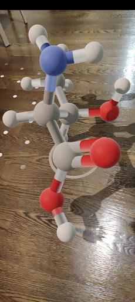
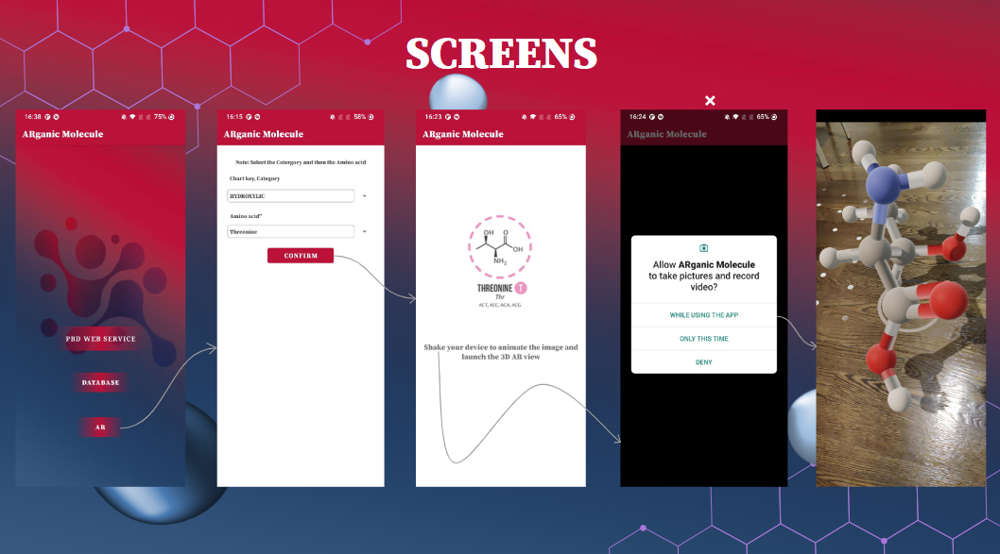
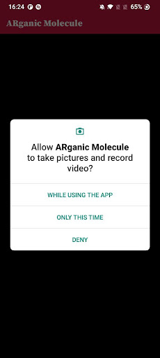

# Mobile App Development - Android && AR [Arganic Molecule] Demo

##  

* Name and partners name
 * Team member 1: *Yangli Liu*
 * Team member 2: *Thinh Lam*
 * Team member 3: *Pranit Brahmbhatt*
 * Team member 4: *Ali Saremi*

* How many hours did it take you to complete this project?   *Around 80 hours in total.*
* Did you collaborate or share ideas with any other people?   *Especially thanks to all my teammates in creating this project. We got the main idea from Thinh Lam.*
* Did you use any external resources? 
  * *https://github.com/google-ar/sceneform-android-sdk/blob/master/LICENSE*
  * *https://square.github.io/retrofit/*
  * *https://github.com/bumptech/glide*
  
* What was the most interesting part of this project? *How to implement an existing database into our mobile app, how to use Firebase for real time message exchange and how to use Sceneform for Augmented Reality.*

  

### Abstract
*ARganic Molecule is an Android mobile App project that focuses on the educational purpose of Protein Molecule.* 

### Project Introduction
ARganic Molecule is an Android mobile App that will serve any students who want to learn chemistry in a fun new way.

It allows you to connect to RCSB Protein Data Bank (RCSB PDB) website. You can search molecules using CFF code and take notes on their formula, weight, id, and name.
You can look through some cute sticker images from the website's Molecule of the Month board. [A7](./app/src/main/java/com/examples/arganicmolecule2/A7)
If you choose to register with us, you will be able to send and receive a sticker from another user. Also, seeing your history of sticker sending. [A8](./app/src/main/java/com/examples/arganicmolecule2/A8)

As we believe Augmented Reality will transform how we teach and learn chemistry sciences in the future. [A9](./app/src/main/java/com/examples/arganicmolecule2/A9)
Enter into AR button, and you can select any organic molecule from a list of molecules and then examine the 3D model of that molecule using their camera sensors and AR in real-time 
on your screen. This will help you learn things quickly in a fun way because atoms and bonds will be color coded which will help you identify and remember things easily.

### How to run this project
All the data files is in the app folder. We use java to create the project. You can use Android Studio to run the project. 
I also put a prebuild apk in the root folder called [ARganic Molecule.apk](https://github.com/xiajingdongning/liuyangli/blob/master/Arganic%20Molecule/ARganic%20Molecule.apk) that you can directly sideload into your android phone for testing.

  
  
  
  

### Deliverables
* I commit all codes to this repository app/src/main/java/com/examples/arganicmolecule2 folder.
* Upload the presentation deck and the project design report to the document folder.
* Put a link to a youtube video in README.md.

