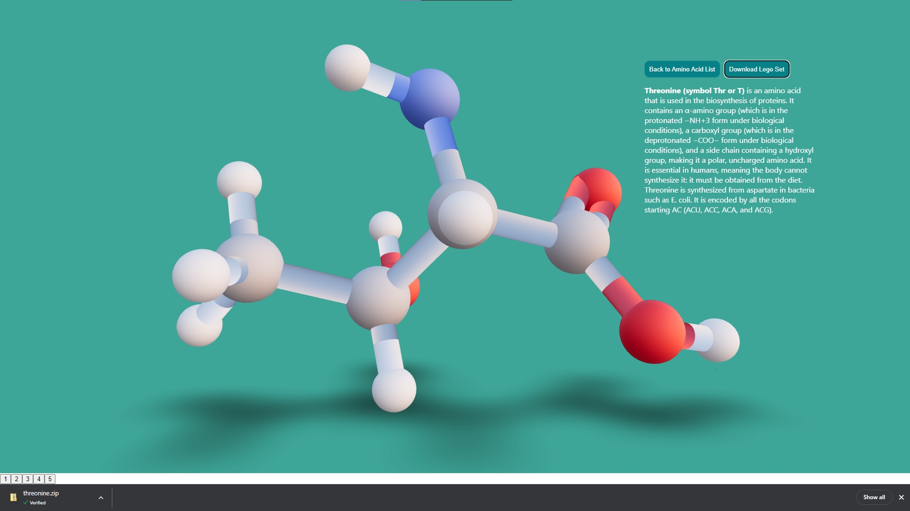
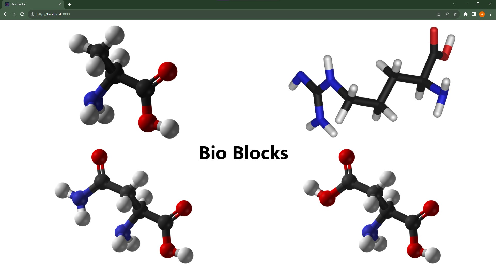
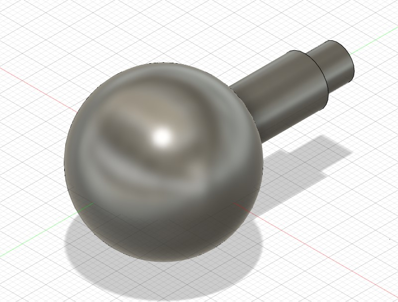
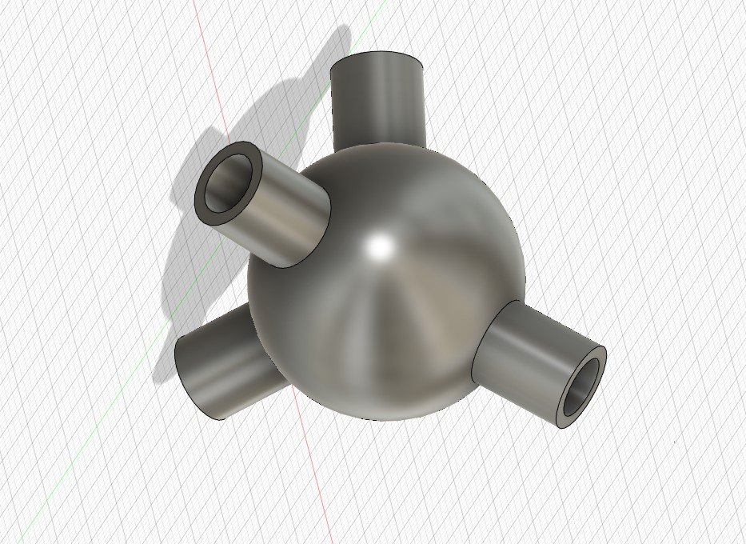

# Bio-Blocks

* Author
 *Yangli Liu* 
 *The copyright for the 3D Lego Pieces belongs to the author. For business usage or any inquiries regarding their utilization, please reach out to the author directly.*
  
* How many hours did it take you to complete this project?   *Around 40 hours in total.*
* Did you collaborate or share ideas with any other people?   *No, this is an independent project.*
* Did you use any external resources? 
  * *https://www.cryst.bbk.ac.uk/education/AminoAcid/the_twenty.html*
  * *https://en.wikipedia.org/wiki*
  * *http://www.futura-sciences.us/dico/d/biology-amino-acid-50004974/*

## Project Introduction
Create an interactive web application Bio Blocks for the project of "Amino Acid 3D Structure Learning Set," 
designed to facilitate student learning of the 3D structures of amino acids. 
This project aims to provide an engaging platform for exploration and understanding through 3D models, 
allowing users to download customized Lego-style pieces for hands-on learning and 3D printing.

<p align="center">
  
</p>

# Setup
1. Clone the code base to desired location
```
$ git clone https://github.com/YangliLiu/Bio-Blocks
```
2. Install required packages 
```
$ pip install @react-three/fiber @react-three/drei firebase
```
3. Get your 3D printing machine/software ready for print
* The LEGO pieces (building blocks) for each amino acid are conveniently bundled in a downloadable zip file.
* Simply click the 'Download Lego Set' button to acquire the file. Once downloaded, unzip the file to access the individual LEGO pieces.
* Take the extracted files to your slicing software, such as Cura, to prepare them for 3D printing. Ensure you follow the proper procedures for slicing to optimize the print quality. Recommend using tree support for black/red/blue pieces.
* After save the sliced pieces to 3D printer like Ultimaker S3/S5s, remember to use proper material (corresponding color) as show in the file name for the better color-coded experience.

# System Implementation
* User Interface (UI)
Develop an interactive React-based web application with 3D models of amino acids. 
Users can explore structures using mouse controls for rotation and navigation.
* Design Representation
Conduct a detailed analysis of existing amino acid structures, translating findings into a comprehensive data representation system. This system will serve as the basis for generating Lego-style building blocks that accurately capture the spatial arrangement and unique characteristics of each amino acid.
* 3D Model Generation using Fusion 360
Utilize Autodesk Fusion 360 to design structural pieces of Lego building blocks. This phase involves meticulous crafting to capture the geometric intricacies of amino acids, ensuring accuracy and visual representation in each Lego-style component.
* Downloadable Lego Pieces
Implement a button for users to download customized Lego-style pieces in a printable file format (e.g., STL) for 3D printing.

# External Software and Tools
You can find detailed instructions of 3D printing here:
https://makerspaces.northeastern.edu/create/library/fdm-3d-printing-diy-training/

# Website
For most users, you can gain easy and convenient access through the official website:
https://bio-blocks-lake.vercel.app/

<p align="center">
  
  
  
  
</p>

### Deliverables
* I commit all codes to the original repository src folder.
* Upload the presentation slide and the project final report to the document folder.
* Put a link to the official website in README.md.


