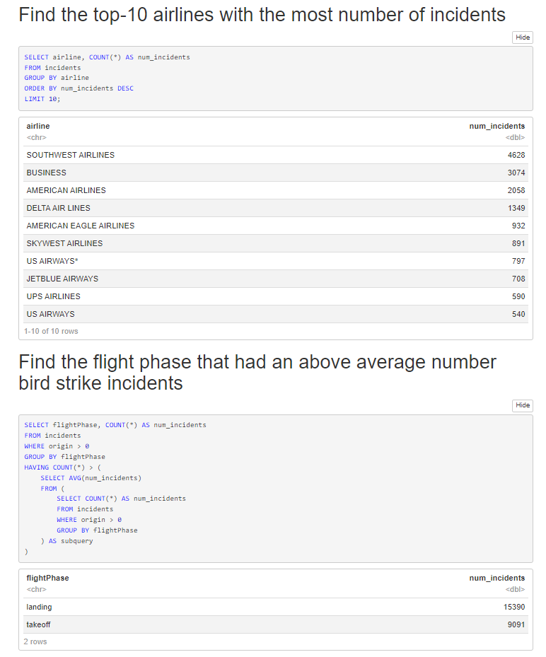
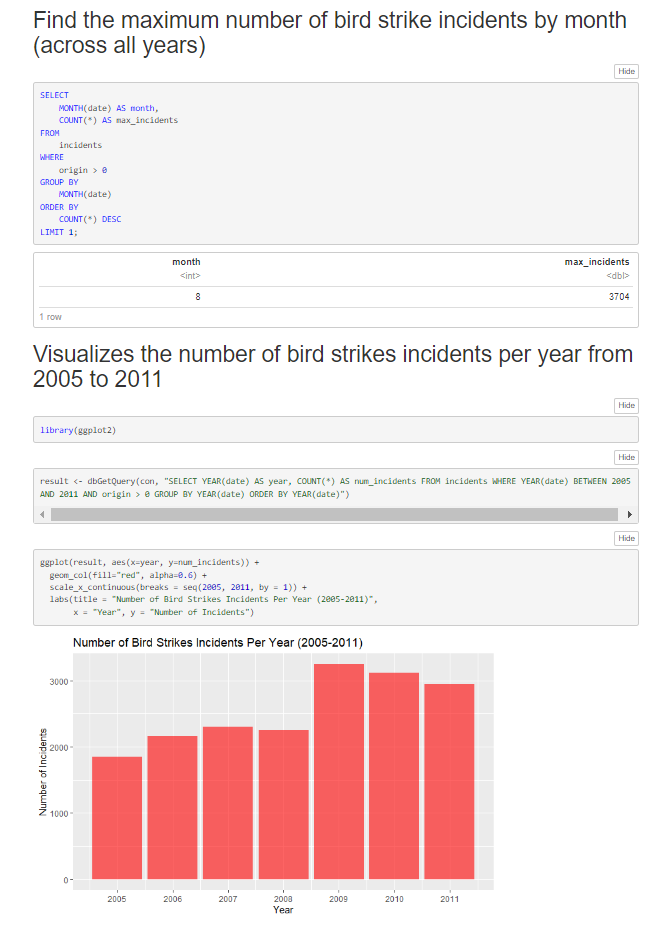
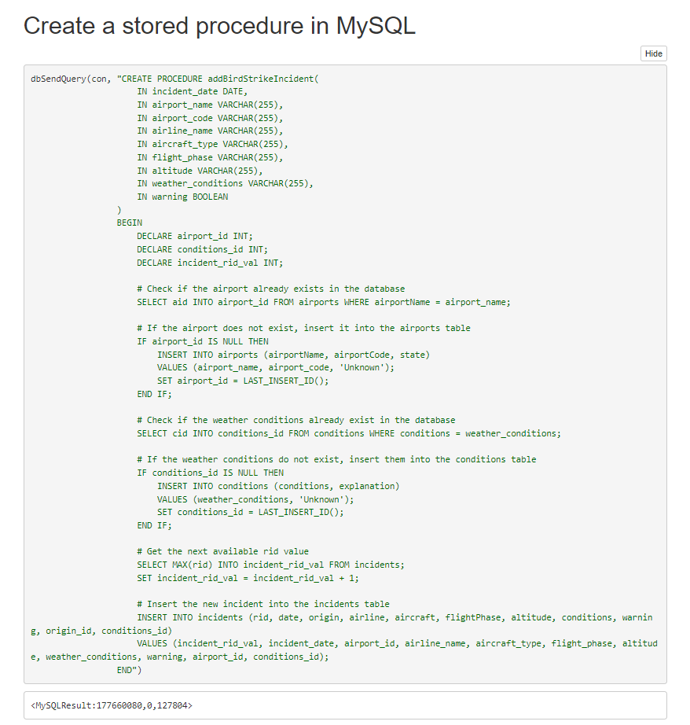
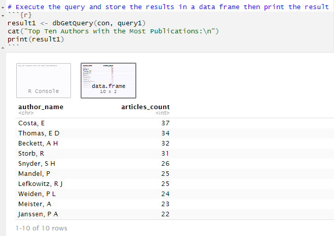
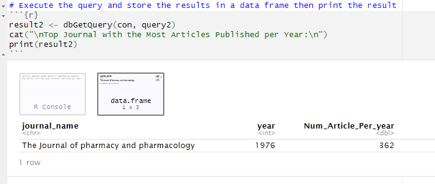

# Database Management - RStudio && SQLite && MySQL [Design & Implement a Relational Database] 

## [HTML Page] (https://htmlpreview.github.io/?https://github.com/xiajingdongning/liuyangli/blob/master/Database%20Management/Design%20%26%20Implement%20a%20Relational%20Database/Practicum%20I.nb.html)

* Name and partners name
 * Team member 1: *Yangli Liu*
 * Team member 2 for Mine a Database: *Minyi Xu*
 * Team member 3 for Investigate Database Architecture Issues report: *Fangying Li*
 

* How many hours did it take you to complete these two projects?   *Around 40 hours in total.*
* Did you collaborate or share ideas with any other people?   * I worked with Minyi Xu for Mine a Database Project*
  
* What was the most interesting part of projects? *How to look things up, how to navigate complex problems, and how to identify and resolve programming errors.*

  

### Abstract

*Database Management has two practicums: Practicum I / Design & Implement a Relational Database and Practicum II / Mine a Database * 

### Project Introduction
In Practicum I, I built a database that can be used to analyze bird strikes on aircraft. For an existing data set from the FAA, 
I built a logical data model, a relational schema, realized the relational schema in MySQL, 
loaded data into the database, executed SQL queries, and finally performed some simple analysis of the data.
###
In Practicum II, Minyi extracted data from an XML document from the subfolder pubmed-tfm-xml and then stored the data relationally in a SQLite database. 
That database represents a "transactional" database. Then I extracted data from the transactional database and 
created an "analytical" database using a star schema in MySQL. Finally, I query facts from the MySQL analytical database. 
This will require that I connected to two different databases simultaneously -- a common occurrence in practice.

### How to run this project
For Practicum I, install/procure MySQL, connect to MySQL from R in an R Notebook, 
load data from CSV files into a relational database through R,
then perform simple analytics in R

  
  
  

For Practicum II, Xu Minyi created a normalized relational OLTP database and populate it with data from an XML document
(https://s3.us-east-2.amazonaws.com/artificium.us/lessons/06.r/l-6-183-extractxml-data-in-r/pubmed-xml-tfm/pubmed22n0001-tf.xml).
Then I added to the normalized schema fact tables and turn the normalized schema into a de-normalized schema suitable for OLAP. 
I used the OLAP star/snowflake schema to do some (simple) data mining. 

  
  

### Deliverables
* I commit all necessary files of Practicum I to this repository Design & Implement a Relational Database folder.
* I commit all necessary files of Practicum II to this repository Mine a Database folder.
* Describe the two Practicums in README.md.
* Add [Explore Data Warehouses](./report/Explore-Data-Warehouses.pdf) report and [Investigate Database Architecture Issues](./report/Investigate-Database-Architecture-Issues.LiF.LiuY.pdf) report to report folder.

