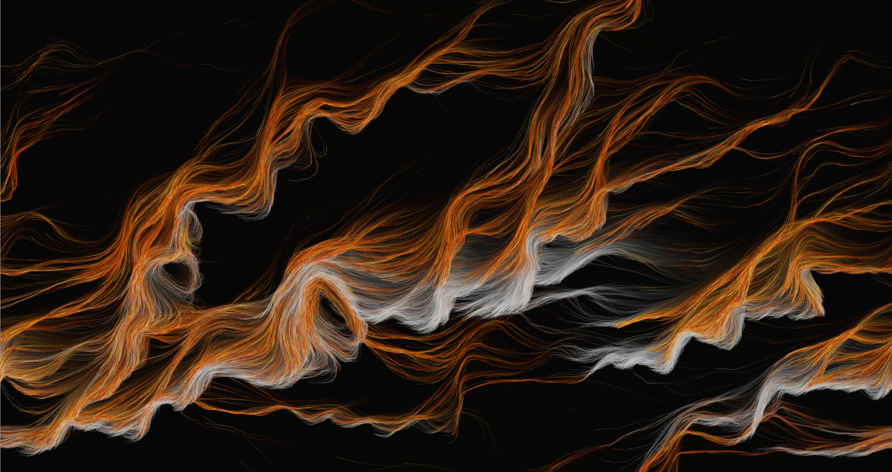

# Processing - Generative Art [Evolving Creations] Demo

##  

* Author
 *Yangli Liu*
  
* How many hours did it take you to complete this project?   *Around 36 hours in total.*
* Did you collaborate or share ideas with any other people?   *No, this is an independent project.*
* Did you use any external resources? 
  * *https://github.com/whitegreen/GenerativeArt/tree/main*
 

* What was the most interesting part of this project? *How to manipulate codes to create desired visual outcomes.*

### Project Introduction
Generative art is a captivating realm where imagination intertwines with code, enabling the creation of dynamic 
and evolving artistic expressions. It harnesses the power of algorithms and computational processes to generate 
unique and unpredictable visual or audiovisual experiences. 
As an artist exploring this medium, I find myself immersed in a world where creativity and computation converge.

Developed specifically for artists and designers, Processing is a versatile programming language and development 
environment that facilitates the creation of interactive and dynamic artworks.

With Processing, I can breathe life into static images, transforming them into living entities that evolve over time. 
By writing code, I define rules and parameters that govern the behavior of elements within the artwork, 
allowing for emergent patterns and surprising variations. The process is akin to composing a symphony, 
where every line of code contributes to the overall composition, dictating the harmony, rhythm, and aesthetic qualities of the piece.

### How to run this project
All codes are written in Java and run in Processing which can be downloaded from https://processing.org/. 
Using processing to run each program by pressing run. Thank you for reading the instruction and enjoy~

### Deliverables
* I commit eight small programs to this repository different folders.
* Each folder exhibits some screenshots from the program.
* Put a link to a youtube video in README.md.

