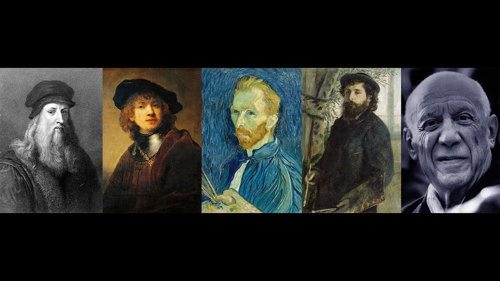

# Java - GUI [Famous Artist Introduction Book] Demo

##  

* Author
 *Yangli Liu*
  
* How many hours did it take you to complete this project?   *Around 60 hours in total.*
* Did you collaborate or share ideas with any other people?   *No, this is an independent project.*
* Did you use any external resources? 
  * *https://en.wikipedia.org/wiki/Leonardo_da_Vinci*
  * *https://en.wikipedia.org/wiki/Rembrandt*
  * *https://en.wikipedia.org/wiki/Vincent_van_Gogh*
  * *https://en.wikipedia.org/wiki/Claude_Monet*
  * *https://en.wikipedia.org/wiki/Pablo_Picasso*
  * *https://www.naxos.com/*
  *These are major sources and you will see citation inside the application GUI as well.*

* What was the most interesting part of this project? *How to create a concrete looping experience, how to create a straightforward and user-friendly interface, and how to achieve aesthetic appearance of design.*

### Abstract
*Famous Artist Introduction Book is an interactive Java application that introduces the five most famous oil painting artists to the audience. 
This project as an educational application is for Primary school students to learn some art history or for people who find art dull before(people who never go to museums or art galleries).* 

### Project Introduction
If taking this application as a project that I shall present to a huge amount of people, who shall be my target audience is the most important question for the project designer to ask. 
For now, I shall take this project as an educational application for Primary school students to learn some art history or for people who find art dull before(people who never go to museums or art galleries). 
In the future, I might consider how to use this experience to figure out what kind of information about art is not very interesting or already well-known to people by collecting data like interaction time through the application. 
This might be useful data for museum or gallery curators to jump out of their set-up frames to think about the museum experience in the post-covid era as only presenting juicy information inside the space to improve their chance of attracting people back to them. 
To think about is there another way that can substitute the original museum experience or extend the original experience in a way that might reduce the risk of exposing people to Covid.

### How to run this project
You will need JFrame and Java3D API to successfully compile the project. 
(1) If you use windows as I do, I have included the java 3D zip file in this submission. You will need to install it on your local computer and build a path through Eclipse. 
Here is the detailed instruction:
https://www.cs.utexas.edu/~scottm/cs324e/handouts/setUpJava3dEclipse.htm

Some tips: You might need to add the library to the classpath and project path with the help of Maven due to some technical issue with this API.
If you still cannot make it works, you can comment out the Instruction class Line 56 and Line 57, this shall allow you to run the application without the final portion of 3D space. 
Then you can see the video (https://youtu.be/euUhRjSjVwU) for the whole experience.

(2) If you use Mac or other systems, you may need to go to the official website of Java3D API here for downloading the zip installation file: 
https://www.oracle.com/java/technologies/java-archive-downloads-java-client-downloads.html#java3d-1.5.1-oth-JPR
Follow the same procedure as above. 

Please keep the file locations as the original submission because moving sound clips to another source folder will break the application. 
Thank you for reading the instruction and enjoy~

### Deliverables
* I commit all codes to this repository src folder.
* I create InitialTest file to this repository test folder for testing.
* I attach the java 3D zip file to this repository third_party folder.
* Upload the project proposal and the project design documents to this repository document folder.
* Put a link to a youtube video in README.md.

