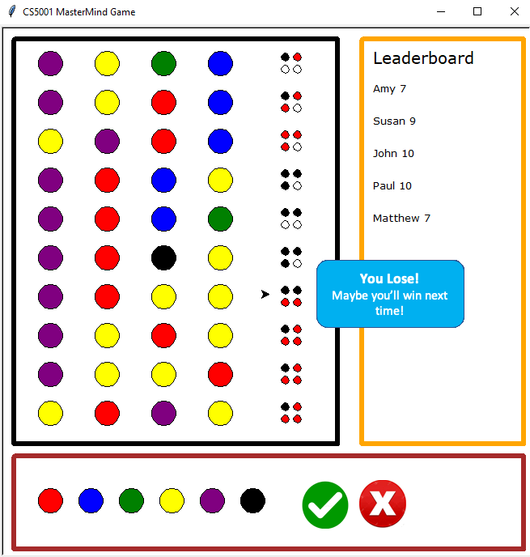
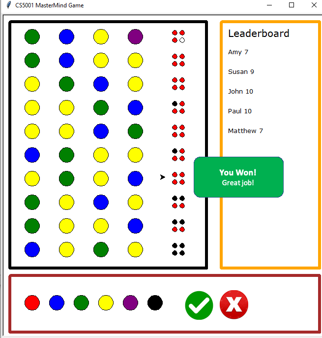

# Python - Game [MasterMind] Demo

##  

* Author
 *Yangli Liu*
  
* How many hours did it take you to complete this project?   *Around 50 hours in total.*
* Did you collaborate or share ideas with any other people?   *No, this is an independent project.*
* Did you use any external resources? 
  * *https://en.wikipedia.org/wiki/Mastermind_(board_game)*
 

* What was the most interesting part of this project? *This one player game allow duplicate input from the player which makes the game more challenging.*

### Project Introduction
You will play this guessing game with computer. The codemaker(computer) chooses a pattern of four code mable pegs. You then tries to guess the pattern, in both order and color, within ten turns. 
Duplicates is allowed while blanks is not allowed. If you guess both color and position of one mable peg right, it means for that mable peg, you get a bull. 
If you only guess color right but not the position, you will get a cow for that mable peg. The small four pegs indicating how well you are playing. Black peg means bull and red peg means cow.
The order of peg feedback is not corresponding to your guess answer. You will win the game by getting four bulls in one row within 10 times. 
Your name will be saved to leaderboard once you win a game. If you are not be able to guess the right answer within 10 times or you choose to quit, you lose.

### How to run this project
All the script files and implementation image files is in the src folder. I use python to create the project.  
*In the command prompt to check is python and pip is installed on your system: python --version*

You can use any IDE or IDLE to run the scripts. You should be able to play the game only using [mastermind_game.py](./src/mastermind_game.py) file.
gamefile.txt stores player's choices and leaderboard.txt file saves the records of other players.
Thank you for reading the instruction and enjoy~

### Deliverables
* I commit all codes to this repository src folder.
* I create test_mastermind_game file to this repository src folder for testing.
* Put a link to a youtube video in README.md.

