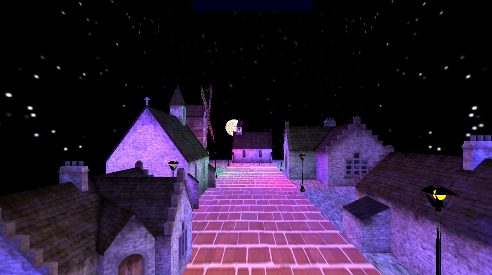
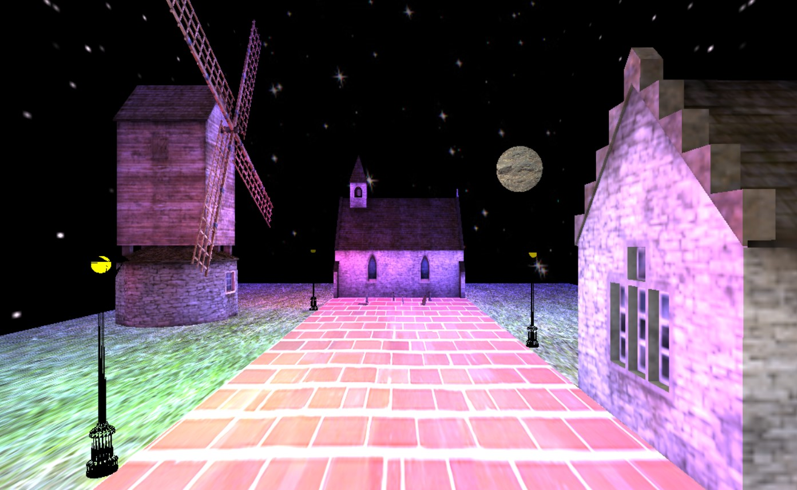

##  

* Author name
  *Yangli Liu*
  
* How many hours did it take you to complete this final project?   *Around 45 hours in total.*
* Did you collaborate or share ideas with any other people? 
* Especially thanks to Prinesh Bansal for giving insights on obj file loading part.
* Did you use any external resources? 
  * *https://learnopengl.com/Lighting/Basic-Lighting*
  * *https://learnopengl.com/Model-Loading/Mesh*
  
  * What was the most interesting part of the Final Assignment? How could the instructor improve the final project?
  * How to implement different shaders to different object and even based on player's position.*

### Rubric

<table>
  <tbody>
    <tr>
      <th>Points</th>
      <th align="center">Description</th>
    </tr>
    <tr>
      <td>Project Completion</td>
     <td align="left"><ul><li>Does the project compile and run.</li><li>Is it polished without any bugs (No weird visual artifacts).</li><li>Did I make a video?</li><li>Did I add a screenshot of your project to the repository?</li></ul></td>
    </tr>
    <tr>
      <td>Technical</td>
      <td align="left"><ul><li>Was the implementation of the project challenging?</li><li>Even if I followed a tutoral, it should not be trivial, and have some personal touch to it.</li><li>Did I have to organize/process a sufficient amount of data?</li><li>Was it clear I consulted some outside resources that go above and beyond the scope of this class</li></ul></td>
    </tr>
    <tr>
      <td>Creativity</td>
      <td align="left"><ul><li>How visually appealing is the scene?<ul><li>Note: There should be some 'wow' factor.</li></ul></li><li>How original is the project<ul><li>Again, did I enhance a tutorial and do something unique or just go by the book?</li></ul></li></ul></td>
    </tr>
  </tbody>
</table>
