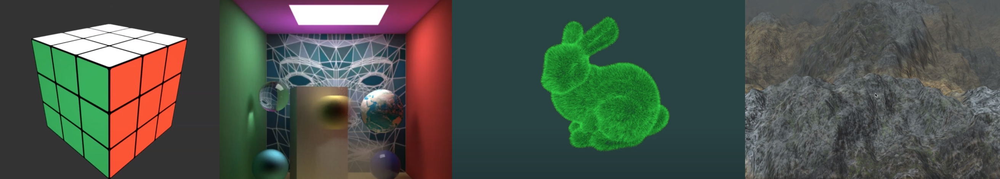

# Final Project - Computer Graphics

## Description

An important part of any computer graphics course, in my opinion, is having the opportunity to build a project that I care about. 

The final project in this course showcases my creativity from what I have learned over the semester and can be used as a portfolio piece for future internship, co-op, and full-time job opportunities.  
  
## Project Ideas

I am going to explore the self-made obj (3D model) loader that I made from scratch and some shader file using glsl.
  
### How to run this project

Use a [build.py](./build.py). You can modify [build.py](./build.py) to your needs, but you should be able to type `python3 build.py` and then run the generated executable. 

As a user who may have no idea what my code does, if you are deploying this software, what you need to do is having your SDL2 setup and perhaps a web browser. 

Logistically, using the [build.py](./build.py) that I have in the repo makes it possible for you to run and debug my project.

### Video Deliverable

For this project, I made a video recording of your project. Here are the specifications:

- An 2-3 minute overview of my implementation as a youtube video.
- Explain what my project is.
- Show what was achieved.
- In the video, I highlight some particular technical achievements.
  - Part of the code or algorithm that does something neat or was difficult to get right.
    - Give a quick 'tutorial'.
    - I talk about other important features in your project, but dedicate some time on one specific item -- using shader files.
    
### Deliverables

* I commit your code to this repository.
* My program needs to compile using a build.py script 
* Put a link to a youtube/vimeo video in previous README.md.
