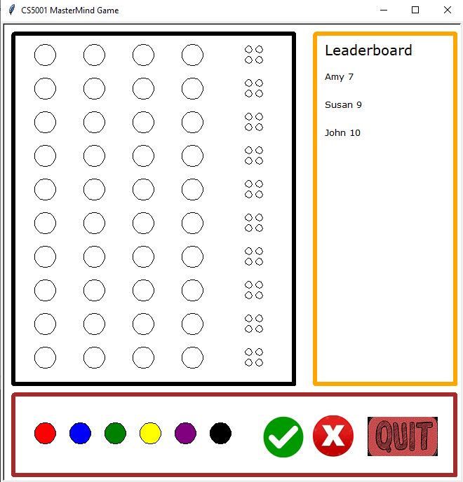
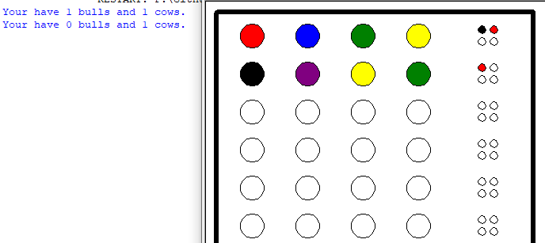

# Yangli Liu's Portfolio

This is my personal git hub repo for exhibiting some of my projects. 
You might find detailed information about each projects in its own section.

## Authors

- [Yangli Liu(Amy)](https://www.liuyangli.ml)

## 🚀 About Me
I'm a current computer sicence student with a previous master degree in interdisciplinary arts (fine art).
I have tried so many things in my life and I love adventures. I often consider myself a creative content creator with a focus on telling unconventional stories through emerging media.
I have the passion for both tech && art and I will treasure any opportunity to partner with expert research scientists or software developers.

## Table of Contents
   
* Python - Game [MasterMind](https://github.com/xiajingdongning/liuyangli/tree/master/Mastermind)
* Java - GUI [Famous Artist Introduction Book](https://github.com/xiajingdongning/liuyangli/tree/master/Famous%20Artist%20Introduction%20Book)
* Computer Graphics - Shader [My Little Town](https://github.com/xiajingdongning/liuyangli/tree/master/My%20Little%20Town)
* Algorithm - Machine Learning [An analysis on Clustering based on Kruskal’s Algorithm](https://github.com/xiajingdongning/liuyangli/tree/master/An%20analysis%20on%20Clustering%20based%20on%20Kruskal%E2%80%99s%20Algorithm)

## Screenshots

[My Little Town](./My Little Town/part1/media/MyTown01.png)

[An analysis on Clustering based on Kruskal’s Algorithm](./An analysis on Clustering based on Kruskal’s Algorithm/media/Improved Kruskal Clustering by CFSFDP.png)

