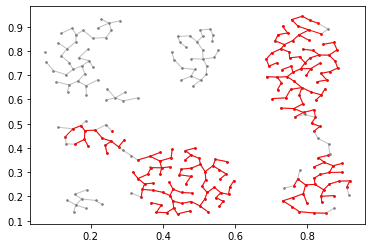

# Yangli Liu's Portfolio

This is my personal git hub repo for exhibiting some of my projects. 
You might find detailed information about each projects in its own section.

## Authors

- [Yangli Liu(Amy)](amy.liu.fz@gmail.com)

## 🚀 About Me
I'm a current computer sicence student with a previous master degree in interdisciplinary arts (fine art).
I have tried so many things in my life and I love adventures. I often consider myself a creative content creator with a focus on telling unconventional stories through emerging media.
I have the passion for both tech && art and I will treasure any opportunity to partner with expert research scientists or software developers.

## Table of Contents
   
* Python - Game [MasterMind]
* Java - GUI [Famous Artist Introduction Book]
* Computer Graphics - Shader [My Little Town]
* Algorithm - Machine Learning [An analysis on Clustering based on Kruskal’s Algorithm]

## Screenshots

