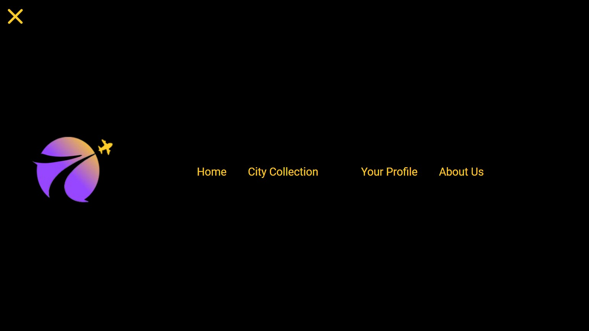
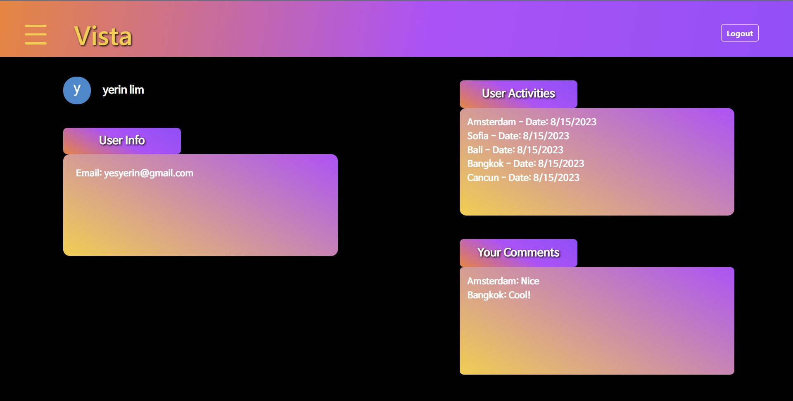
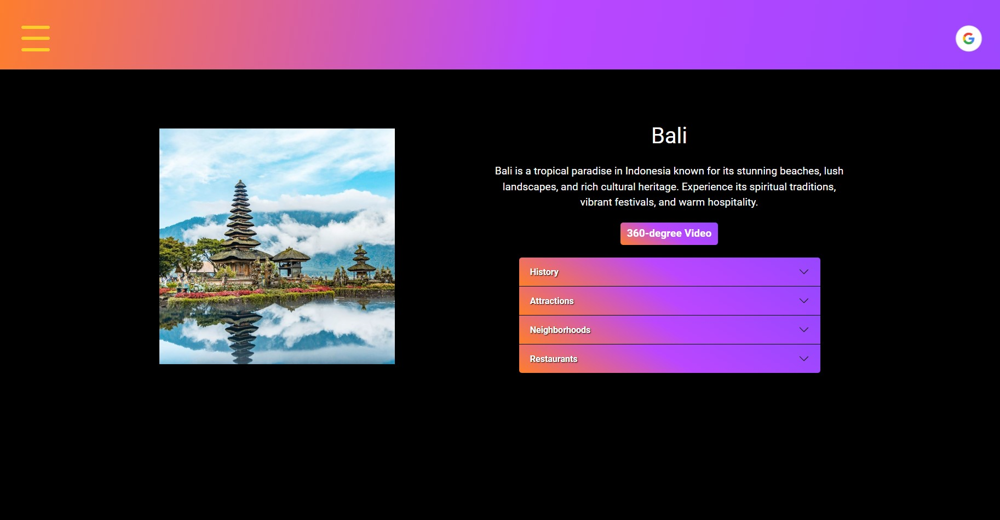
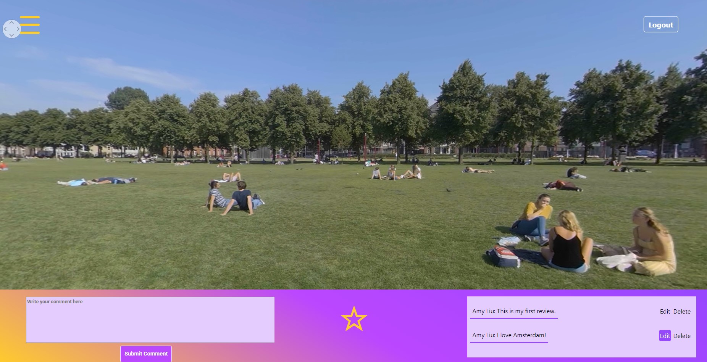

# Web Development - MERN stack [Vista] 

## 

* Name and partners name
 * Team member 1: *Yangli Liu*
 * Team member 2: *Yerin Lim*
 * Team member 3: *Yiqing Ma*

* How many hours did it take you to complete this project?   *Around 100 hours in total.*
* Did you collaborate or share ideas with any other people?   *Especially thanks to all my teammates in creating this project. I am the team lead.*
* Did you use any external resources? 
  * *https://photo-sphere-viewer.js.org/*
  * *https://codesandbox.io/s/react-tinder-card-demo-8tzm6?file=/src/serviceWorker.js*
  * *https://www.vr-gorilla.com/*
  * *https://unsplash.com/*
  
* What was the most interesting part of this project? *Building interactive web application and integrating 360-degree video is technically challenging. 
Acquiring accurate and high quality content (e.g., images, videos, and information) for different locations is also difficult as we did not find usable existing database.
But the most interesting part is creating that astonish 360 degree landing page.*

  

### Abstract
*Vista is an innovative React Web App project designed to provide users with an immersive and user-friendly platform for virtual exploration of thirty major cities across the globe. 
The project is centered around enhancing the user experience through creative features, 
such as GIF cursors and a captivating 360-degree landing page, aiming to create an engaging and vivid virtual travel encounter.* 

### Project Introduction/Key Features
* GIF Cursor and 360-Degree Landing Page: The project leverages GIF cursor technology and a dynamic 360-degree landing page to establish an interactive 
and enjoyable user interface that simulates a travel experience inside the digital painting.

* City Selection and Guide Pages: A dropdown menu on the landing page enables users to select their desired city. Upon selection, users are seamlessly 
redirected to individual city guide pages, which furnish comprehensive information about the city's history, notable attractions, distinguished restaurants, 
and vibrant neighborhoods.

* 360-Degree Video Tours: The platform showcases a repository of hosted 360-degree video content, affording users the opportunity to virtually tour diverse locations, 
delivering an immersive experience akin to actual travel.

* City Collection and Personalization: Users can personalize their experience by saving preferred cities to their City Collection. 
By clicking the star icon, selected cities are saved as cards. The collection can then be organized through a swipe-based interface, 
allowing users to manage their selections effortlessly.

* Comment Functionality: Vista facilitates user engagement by permitting comments on specific 360-degree videos. 
Users can make, edit, or delete their comments, fostering an interactive community within the platform.

* User Profile Page: The user profile page offers a comprehensive overview of user activities. This includes a log of the comments users 
have contributed and the cities they have virtually explored, creating a sense of personalization and achievement.

* About Us Page: The final page is dedicated to introducing the project's creators. This section provides succinct information about 
the development team, offering users insights into the minds behind the creation of this unique virtual exploration platform.

## How to run this project
All the data files are stored into MogoDB. We use React framework and JavaScript, HTML, CSS to create the project. 
You can use VS Code and MongoDB to run the project locally.
Or directly visit our website at: https://vista-neu.uw.r.appspot.com/

  
  
  
  

### Deliverables
* I commit all codes from the front end to this repository Vista-frontend/src folder.
* I commit all codes from the back end to this repository Vista-backend/src folder.
* Put a link to the Google Cloud Deployment for final product in README.md.

