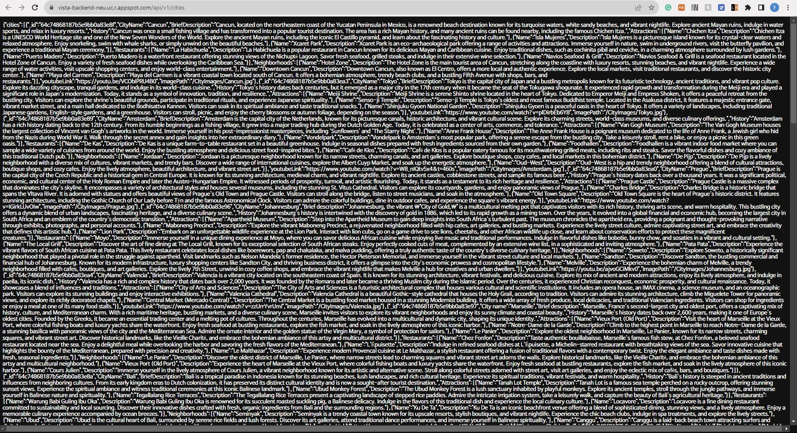
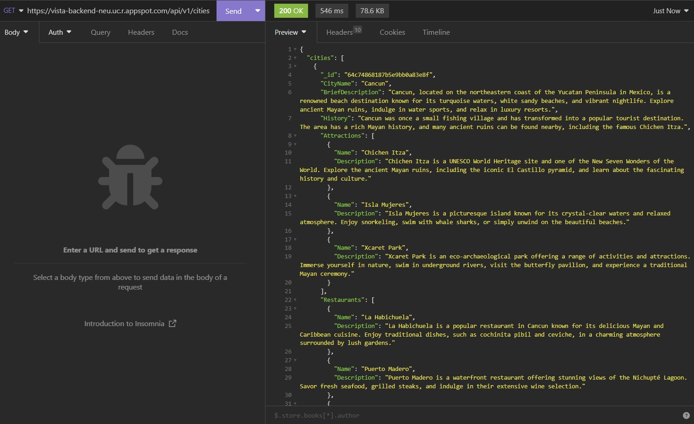
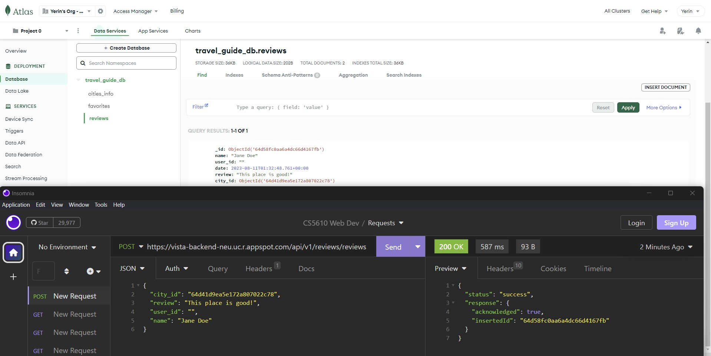
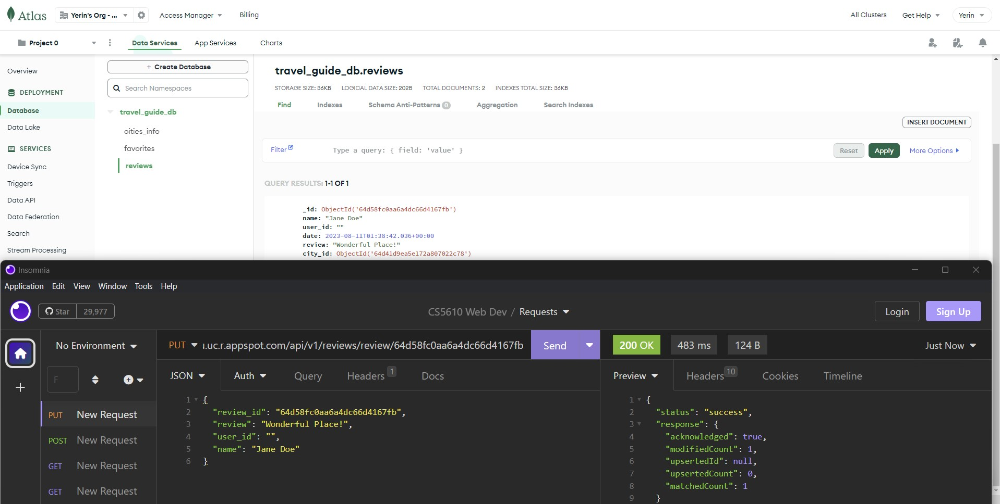
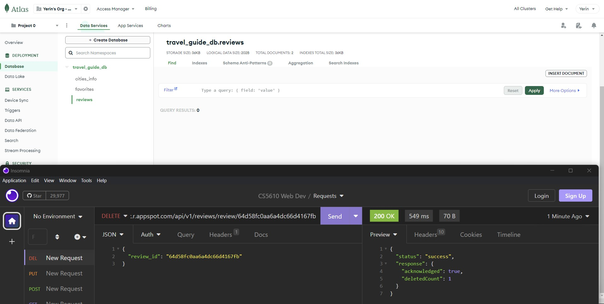

# Travel Guide Backend 

Team Member: Yerin Lim, Yiqing Ma, Yangli Liu

Google Cloud deployment Link: https://vista-backend-neu.uc.r.appspot.com/api/v1/cities

# Prerequisites
Node.js - You should have Node.js installed on your machine to run this project locally. 

TravelGuide is a backend server developed using Express.js and MongoDB for managing cities, reviews, and user favorites. It is part of a larger project providing travel recommendations and reviews for cities worldwide.

# Usage

Once the server is running, it exposes several API endpoints:

GET /api/v1/cities: Retrieves a list of all cities.

GET /api/v1/cities/id/:id: Retrieves a single city by its ID.

POST /api/v1/reviews: Adds a new review.

PUT /api/v1/reviews/:reviewId: Updates an existing review by its ID.

DELETE /api/v1/reviews/delete: Deletes an existing review.

PUT /api/v1/favorites: Updates a user's favorites.

GET /api/v1/favorites/:userId: Retrieves a user's favorites by the user's ID.

# Iter1 Status

Infrastructure: Server is running properly and the connection with MongoDB has been established. The controllers, routes, and data access object (DAO) files have been set up for cities, reviews, and favorites.

Functionality: Routes and controllers set up to fetch data about cities, add/update/delete reviews, and update/get user favorites. However, the data fetching from MongoDB doesn't seem to be working as expected.

Issue: When trying to fetch the data locally, the response does not include any data. Instead, it shows an empty cities array, page as 0, filters as an empty object, and entries_per_page as 20.

Issue Sloved.

* Backend API Response  

# Iter2 Status

Controllers and Routes are updated.
Added CRUD operations for reviews.
Updated database with embeded youtube url. 

* Backend API Response  

# Contributions

## Iter 1

Yerin Lim

1. I fixed errors from the existing skeleton backend code.
2. I changed the functions in API and DAO to get data for frontend.
3. I fixed the deployment problem which was due to app.listen conflict.

Yiqing Ma

I've been closely involved in building the backend server using Express.js and MongoDB. The aim of our project is to provide a comprehensive travel recommendation and review platform for cities worldwide. Currently, the server successfully manages cities, reviews, and user favorites. I have helped set up several API endpoints that allow fetching city data, manipulating reviews, and updating or retrieving user favorites. However, we've recently run into an issue with our data fetching operation. Despite our server running smoothly and the successful connection with MongoDB, the data we fetch doesn't seem to be working as expected. Rather than obtaining city data, we're seeing an empty cities array. Similarly, the 'page' is shown as 0, 'filters' as an empty object, and 'entries_per_page' as 20. As of now, my team and I are working diligently to debug this problem and ensure that our TravelGuide project operates smoothly. I've managed to solve the issue we were experiencing with our data fetching operation. After deep-diving into the problem, conducting thorough checks on the database, model configurations, connection string, controllers, middleware, and pagination setup, Yerin Lim was able to locate and address the cause of the issue. The root of the problem lay in the Mongoose model definitions that did not align with the collection names in the MongoDB database. The process of troubleshooting this problem was both challenging and enlightening. It involved extensive research, meticulous testing, and ample utilization of my problem-solving skills. I was reminded of the importance of accurate debugging and the need to maintain a deep understanding of how each component of our backend server operates. Having resolved the issue, our TravelGuide backend server is now functioning correctly. It's reliably fetching data from the MongoDB database, and the response now includes all the necessary city data, instead of the previously encountered empty array. This accomplishment represents a significant step forward for our project. The fix not only rectifies the immediate issue but also reinforces the stability and reliability of our platform, ensuring our users have a seamless experience when seeking travel recommendations and reviews. I am looking forward to continuing my work on the TravelGuide project, enhancing its features and functionality even further.

## Iter 2
Yerin Lim
1. I updated database with correct data and verified it.
2. I tested the updated backend api.

Yiqing Ma

Fetching Data:
I used React's useEffect to fetch data when my Video component mounts. Specifically, I'm retrieving city details and associated reviews.I integrated with my service layers, CityDataService and ReviewsDataService, which make HTTP requests to get city details by ID and fetch reviews associated with a city.
Displaying Video:
Within my component, I embedded a YouTube video through an iframe. The source of this video is dynamically set based on the city's data.
Commenting System:
I introduced a stateful comment variable to hold the current comment text.
Users can type their comment in a textarea, and upon submission, this comment is sent to the backend for saving using the ReviewsDataService.postReview method.
Update & Delete Reviews:
I added functionality for users to edit their existing reviews. For each comment, I introduced an "Edit" button. When clicked, the associated review text populates the comment text area, preparing it for an update.
I integrated the backend service ReviewsDataService.updateReview to handle updates. Once a review is updated, the comment textarea is reset.

## Iter 3

Yerin Lim

1. I implemented the functionality that a user can check their own comments on the user profile page.
2. I updated the database because of the city replacement.

Yiqing Ma

"City Collection" feature:
 On the backend, I enhanced the structure and flow of the server and its connection to MongoDB. Additionally, I integrated the react-tinder-card library to create swipeable card components. 

Code Refinement:
There was a significant amount of code enhancement done. This included:Using asynchronous operations more efficiently with the async/await syntax.Streamlining the handleStarClick function to be more concise and effective.Ensuring the component re-renders properly when favorites are updated.