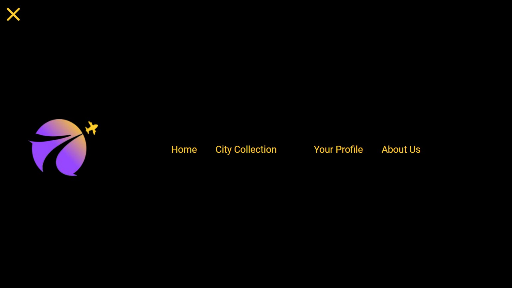
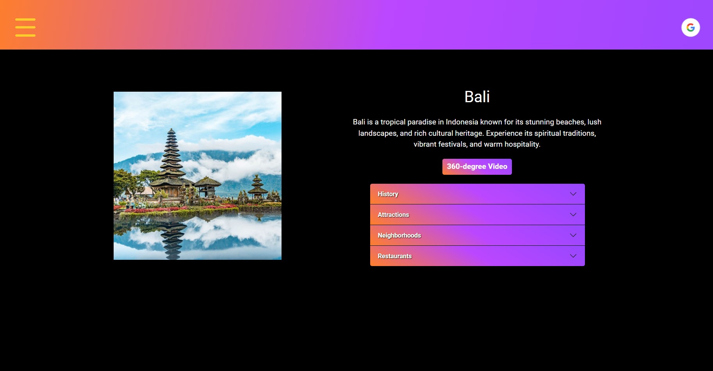

# Vista [Virtual Travel Guide Front End]

## Team Member: Yerin Lim, Yiqing Ma, Yangli Liu

Google Cloud deployment Link: https://vista-neu.uw.r.appspot.com/

* Enables virtual exploration of thirty major cities around the world with 360-degree videos.
* Users can implement a platform for commenting or communicating with each other.
* 360-degree video tours: Hosted 360-degree video content that allows users to virtually experience different locations.
* Complexity: Building interactive web application and integrating 360-degree video is technically challenging.
* Content Acquisition: Acquiring accurate and high quality content (e.g., images, videos, and information) for different locations can be challenging.

* Customizing the third party navigation bar 

* User Profile page

* City Dropdown

* City Guide Page

* 360-degree video page with comment bar design

* City Collection page with swipe effect and animation design

## Contributions

### Iter 1

### Yangli Liu

#### 360-Degree Landing Page:

* Created a beautiful 360-degree image using an AI tool, aligned with our color scheme.
* Researched third-party libraries for integrating the 360 image into our React app.
* Explored options like Panolens.js and React 360, but they didn't quite fit our needs.
* Opted for Photo Sphere Viewer, a JS solution based on three.js, ensuring high performance on WebGL-enabled systems.

#### Immersive Navigation:

* Sought a navigation bar solution suitable for the 360-degree landing page.
* Chose the "overlay-navbar" package and customized it to blend seamlessly with the website's aesthetics.
* Redesigned the logo, favicon, and navigation bar logo for a cohesive look.
* Added dynamic elements like a fly-in animation for the title and a GIF cursor image.
* Crafted an engaging drop-down menu with a captivating linear-gradient design.

#### Interactive Features:

* Designed a user-friendly comment bar on the video page, complete with a star-based rating system.
* Gave the profile page a stylish makeover using a linear-gradient design.

### Yerin Lim
1. I set up the skeleton for frontend.
2. I implemented a google authentication.
3. I created Login button with a Google logo and after the user login it shows logout button with a profile photo.
4. I created a user profile page that can be accessed only login users and showed the user information from google.
5. I fetched data to show 30 cities in the dropdown menu and created a scroll bar and adjusted the size to show an adequate amount of items.

### Iter 2

### Yerin Lim

1. I created a city guide page that includes a photo of the city and city information.
2. I created a button that leads to the page that shows the city's video and the comment bar.
3. I added responsive design.

### Yiqing Ma
I focused on building a video playback feature for my application using React. My initial approach was to have a dynamic video page, which would play a video based on the provided URL.

Components and Implementation

Landing Page (Landing.js):
Each video had an associated videoUrl which points to its location on YouTube.
For each video, I provided a link that would direct users to a separate page (Video.js) where the video can be played.
Video Page (Video.js):
I aimed to use React Router's useParams hook to fetch the video's URL from the route and then use it to embed the YouTube video using an iframe.
Challenges & Solutions

I encountered an error indicating that the variable videoUrl was not defined in the Video.js component. After reviewing the code, I realized that while I was using videoUrl in the Landing.js, I mistakenly referred to it as videoId in the Video.js component. I corrected this inconsistency to fix the issue.
A more significant challenge arose when I tried to navigate to a video page using the video's full embed URL as a route parameter. This approach resulted in route matching errors due to the special characters in the URL. To address this, I decided to adopt a more conventional routing approach:
I considered using a unique ID or slug for each video as the path parameter instead of the whole URL.
Instead of embedding the URL directly into the route, I thought about passing it as state when navigating. Alternatively, if using an ID or slug, I could fetch the corresponding URL when landing on the video page.
I realized the importance of setting up my React Router Route properly to match the structure I was aiming for.

### Yangli Liu

#### Enhanced Responsiveness:

* Addressed responsive issues on the landing page, profile page, and video page's comment bar.
* Ensured a seamless user experience across various devices.

#### Dynamic Card Effect:

* Explored the shuffle card libraries, initially using framer-motion.
* Settled on the "react-tinder-card" third-party library to achieve the desired card restoration effect.
* Dealt with a bug in the latest version by reinstalling the correct version: 'npm i * react-tinder-card@1.5.0, npm i @react-spring/web.'
* Incorporated mobile-responsive animations triggered by buttons for an enhanced user experience on cellphones.

#### Consistent Design:

* Improved the responsive design of the city collection page for a uniform and polished appearance.

### Iter 3

### Yerin Lim

1. I implemented the functionality that a user can check their own comments on the user profile page.

2. I created the comment list box on the right side of the comment bar that can show the users' comments clearly. I tested to make sure that the box can handle the number of comments and a long comment can be visible.

3. I implemented the edit and delete functionality and designed the buttons that show up right next to the comment. Only the owner of the comments can see those buttons. Also, I handled the errors when the user tried to submit an empty comment, and when not logged in users try to leave comments.

4. I worked on improving the user experience for this website. For example, for the editing comments, after a user clicks the edit button, the focus goes to the textbox automatically to let them edit comments without confusion.

5. I improved the city guide page design by changing the 360 video button position to avoid accordion's expansion.

### Yiqing Ma

"City Collection" feature:

I refined the architecture and codebase of our city collection application. I implemented frontend functionalities, which involved fetching city data and favorites, and then displaying them in interactive UI components. I tackled numerous frontend errors related to React hooks, service imports, and state management.

"Cards" feature:

I analyzed and debugged the codebase for the card swiping feature, identifying a null reference issue in the outOfFrame function of the Card component. I implemented null-checks for childRefs[idx].current before accessing its properties and ensured the correct initialization of refs based on the currentCards array. This resolution safeguards against potential runtime errors and enhances the robustness of the card swiping functionality."

Debugging "Favorites" Feature:

I identified and rectified a bug related to how the favorite cities were being toggled. There was a need to check the city's presence in the user's list of favorites to determine the star's appearance (filled or hollow). By working together, we ensured the favorites were being updated accurately and the UI reflected these changes in real-time.

### Yangli Liu

#### Vivid About Us Page:
* Incorporated round shapes for displaying team member images
* Designed a three-column layout and footer bar for a cohesive look
* Maintained consistency with AI avatar images and color palette

#### Responsiveness Iteration:
* Addressed responsive issues on the landing page log out button, video page's comment bar, and About Us page
* Enhanced the City Guide Page with a full-screen black background on all devices
* Made minor adjustments to the City Collection Page

#### Incorporated User Feedback
* Resolved the Video Page iframe issue, providing a full-screen video experience
* Introduced a hint text for the user comment bar function when the bar is collapsed
* Provided user guidance for the Like function (Star)
* Restricted users from editing reviews authored by others
* Enhanced the user experience by updating the submit comment button text to "Save Edit" for clarity

